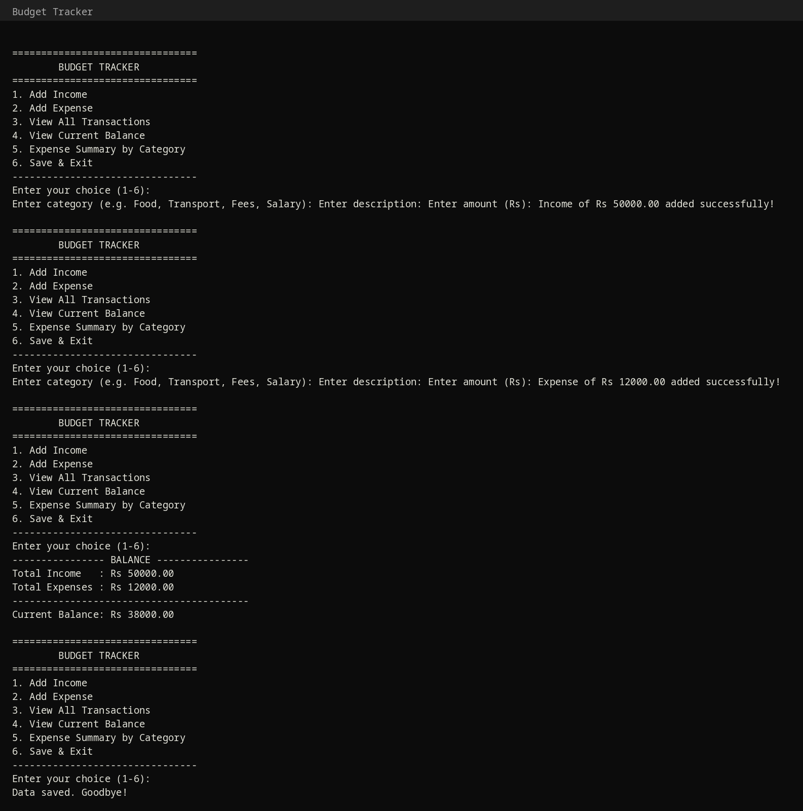
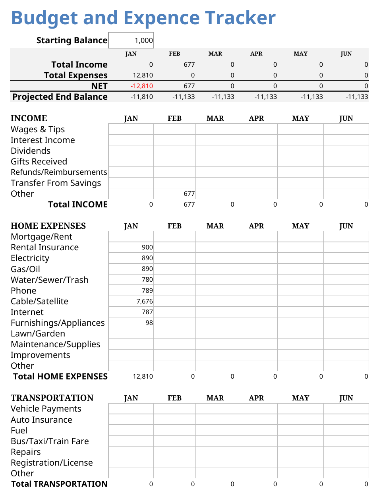

# 💰 Budget Tracker

My **first-semester Programming Fundamentals (PF) project** — a personal budget tracker built in **two versions**: a C++ console application and an Excel workbook.

## 📁 What's inside

| File | Description |
|---|---|
| `budget_tracker.cpp` | Console-based budget tracker written in C++ |
| `Budget_Tracker.xlsx` | Excel version — monthly budget & expense tracker with charts |
| `screenshots/` | Screenshots of both versions |

---

## 🖥️ Version 1 — C++ Console App

A menu-driven program that lets you:

- ➕ Add income and expense records (with category & description)
- 📋 View all transactions in a formatted table
- 💵 View current balance (income − expenses)
- 📊 See an expense summary grouped by category
- 💾 Save/load all data to a text file automatically

**Concepts used:** structs, vectors, functions, loops, file handling (`ifstream`/`ofstream`), formatted output (`iomanip`).

### How to run

```bash
g++ -o budget_tracker budget_tracker.cpp
./budget_tracker
```

### Screenshot



---

## 📊 Version 2 — Excel Workbook

A monthly **Budget and Expense Tracker** spreadsheet:

- 📅 Month-wise tracking (JAN–DEC) with Total and Average columns
- 💵 Starting balance, total income, total expenses, NET and projected end balance
- 🗂️ Categorized sections: Income, Home Expenses, Transportation
- 📈 Built-in charts: income vs expenses trend and expense breakdown

### Screenshot



---

## 🛠️ Tech

- C++ (console application)
- Microsoft Excel (formulas, charts)

## 👩‍💻 Author

**Ayesha Shoukat** — Computer Science @ UET Narowal
